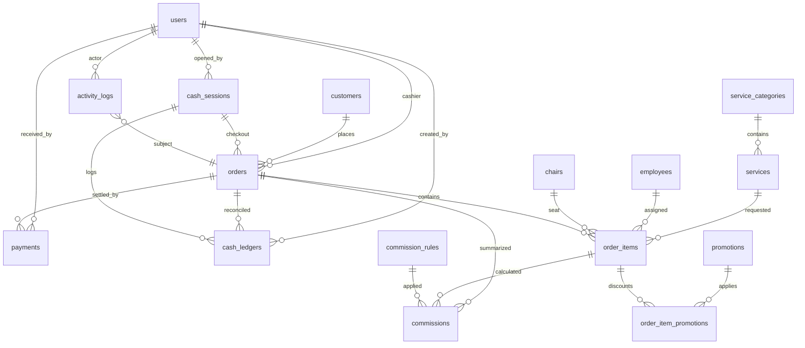
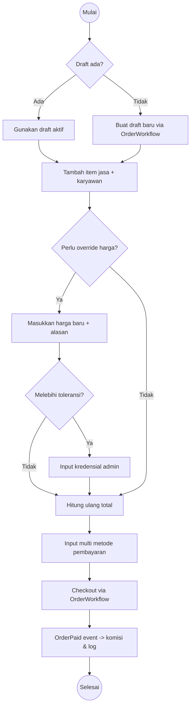

# Kasir Pangkas POS

POS barbershop berbasis Laravel 12, Tailwind, dan Laravel Breeze sesuai _projectPlan.md_. Sistem ini menyediakan tiga area utama:
kasir untuk menjalankan POS, admin panel untuk mengelola master data dan laporan, serta dashboard stakeholder untuk memantau
kinerja usaha.

## Arsitektur Singkat
- **Framework**: Laravel 12.x (PHP 8.4), Vite + Tailwind 3 untuk antarmuka.
- **Autentikasi**: Laravel Breeze dengan UUID sebagai primary key, timezone default `Asia/Jakarta`.
- **Lapisan Domain**:
  - *Models* dengan relasi & scope laporan (`scopePaidBetween`, `scopeByEmployee`, `scopeByService`).
  - *Policies* membatasi akses: kasir hanya POS & kas, stakeholder read-only, admin penuh.
  - *Services* memusatkan logika bisnis: `PricingService`, `CommissionService`, `CashService`, `OrderWorkflow`, `ReportExportService`.
  - *Events* (`OrderPaid`, `PriceOverridden`, `CashSessionClosed`) + listener untuk komisi, logging override, dan ringkasan kas.
  - *ActivityLog* menangkap semua aksi penting dengan payload JSON.
- **UI**: Blade + komponen Tailwind dibagi untuk POS kasir, panel admin (resource CRUD & laporan), dashboard stakeholder (KPI & grafik).
- **Reporting**: Halaman laporan + ekspor CSV/PDF (PDF dibangun manual tanpa paket eksternal sesuai batasan).

## Modul Utama
| Modul | Deskripsi |
| --- | --- |
| POS Kasir | Pengelolaan draft order, item multi orang (person_label), override harga dengan alasan & otorisasi admin di atas toleransi, multi metode pembayaran, sesi kas. |
| Admin | CRUD master data (jasa, kategori, karyawan, pelanggan, kursi, shift, aturan komisi, promo), laporan penjualan/karyawan/kas/diskon, log aktivitas. |
| Stakeholder | Dashboard baca-saja berisi KPI, tren 30 hari, jasa terlaris, kontribusi karyawan dan komisi. |
| Laporan | Filter tanggal, ekspor CSV/PDF, indeks database di kolom filter (status, paid_at, opened_at). |
| Kas | Pembukaan & penutupan sesi kas, ledger in/out, perhitungan variance otomatis. |

## Basis Data (ERD)


## Alur Checkout POS


## Instalasi & Menjalankan Proyek
1. **Persiapan kode**
   ```bash
   git clone <repo>
   cd KasirPangkas
   cp .env.example .env
   ```
2. **Konfigurasi `.env`** (contoh penting):
   ```env
   APP_NAME="Kasir Pangkas"
   APP_URL=http://localhost
   APP_TIMEZONE=Asia/Jakarta
   DB_CONNECTION=mysql
   DB_HOST=127.0.0.1
   DB_PORT=3306
   DB_DATABASE=kasir_pangkas
   DB_USERNAME=root
   DB_PASSWORD=secret
   ```
3. **Dependensi**
   ```bash
   composer install
   npm install
   ```
4. **Setup aplikasi**
   ```bash
   php artisan key:generate
   php artisan migrate --seed
   npm run build   # atau `npm run dev` saat pengembangan
   php artisan serve
   ```
5. **Akun demo hasil seeder**
   | Peran | Email | PIN | Password |
   | --- | --- | --- | --- |
   | Admin | `admin@kasirpangkas.test` | 9999 | `password` |
   | Kasir | `kasir@kasirpangkas.test` | 1234 | `password` |
   | Stakeholder | `stakeholder@kasirpangkas.test` | - | `password` |

## Struktur Direktori
```
app/
  Events/                # OrderPaid, PriceOverridden, CashSessionClosed
  Http/
    Controllers/
      POS/               # POS endpoints (order, items, cash)
      Admin/             # CRUD master data & laporan
      Stakeholder/       # Dashboard & snapshot API
    Requests/            # FormRequest dengan aturan domain
  Listeners/             # GenerateCommission, LogPriceOverride, GenerateCashSummary
  Models/                # Eloquent dengan relasi, casts, scope laporan
  Policies/              # Hak akses per peran
  Services/              # Pricing, Commission, Cash, OrderWorkflow, ReportExport
config/app.php           # Timezone Asia/Jakarta
resources/views/         # POS layout, admin panel, stakeholder dashboard
routes/web.php           # Pemetaan route eksplisit
database/
  migrations/            # Skema lengkap + indeks & constraint
  seeders/MasterDataSeeder.php
  factories/             # Factory domain lengkap
```

## Event & Payload
| Event | Pemicu | Payload penting |
| --- | --- | --- |
| `OrderPaid` | Checkout sukses | `order` dengan relasi `items`, `payments` untuk listener komisi. |
| `PriceOverridden` | Override harga item | `item`, `actor`, `approver` dicatat ke `activity_logs.meta`. |
| `CashSessionClosed` | Tutup kas | `cashSession` untuk ringkasan dan audit variance. |

## Layanan Domain
- **PricingService**: hitung line total, refresh total order, enforce toleransi override.
- **CommissionService**: pilih aturan (prioritas per service → level karyawan → global) & simpan `commissions`.
- **CashService**: buka/tutup sesi, hitung expected cash dari pembayaran + ledger, simpan variance.
- **OrderWorkflow**: start draft, tambah/ubah/hapus item, override harga, checkout multi pembayaran, void order.
- **ReportExportService**: ekspor CSV & PDF (generator PDF manual tanpa library pihak ketiga sesuai batasan).

## Aktivitas & Logging
Semua aksi kritikal (tambah item, override harga, checkout, cash ledger, penutupan kas) ditulis ke tabel `activity_logs`
dengan `meta` JSON. Hal ini memudahkan audit internal maupun stakeholder.

## Pengujian
```bash
php artisan test
```
> Pengujian mencakup unit test `PricingService` dan `CommissionService`, serta feature test alur POS (tambah item, override sah/tidak,
> checkout + komisi) dan siklus kas (buka, ledger, tutup dengan variance).

## Data Seeder & Contoh Data
Seeder mengisi:
- Setting override harga (`override_price_limit_percent=15`, `require_admin_approval_above_limit=1`).
- Kategori & jasa (Classic Cut, Premium Cut, Color Touch-Up, Scalp Treatment, Kids Cut).
- Karyawan level junior/senior/master.
- Pelanggan contoh, kursi barber, shift Pagi & Sore.
- Aturan komisi (per jasa, per level master, global default).
- Akun demo tiga peran.

## Keputusan Desain & Catatan
- **PDF ekspor manual**: Untuk memenuhi syarat "tanpa paket pihak ketiga yang tidak perlu", generator PDF sederhana ditulis
  sendiri; cukup untuk ringkasan tabel laporan.
- **Kolom `service_categories.order`**: Mengikuti plan meski kata `order` reserved di SQL; Laravel menangani dengan quoting otomatis.
- **Caching Setting**: `Setting::getValue` memakai cache 60 menit; seeder dan test melakukan `cache()->flush()` sebelum update agar
  nilai override terbaru dipakai.
- **Override harga**: Manual price membutuhkan alasan; di atas toleransi wajib menyertakan `approver_id` admin, dicatat dalam
  `activity_logs.meta` untuk audit.
- **Timezone**: Seluruh timestamp tampil menggunakan `Asia/Jakarta`, termasuk formatting di Blade dan service kas.

## Jalankan Build Frontend
- `npm run dev` untuk HMR pada POS/Admin UI.
- `npm run build` untuk produksi (Vite menghasilkan asset Tailwind optimal).

Selamat menggunakan Kasir Pangkas POS! Dokumentasi ini menjadi titik awal untuk pengembangan fitur lanjutan seperti integrasi
loyalty atau inventory produk grooming.
